# VMR0014 Electric and Hybrid Vehicles and Mobile Machinery (AMS-III.C. Revision), v1.0

CDM methodology *[AMS-III.C.: Emission Reductions by Electric and Hybrid Vehicles](https://cdm.unfccc.int/methodologies/DB/HLOH5R7J6M96A23TFECTQ1BVIE24CK)* (external) quantifies GHG emission reductions from project activities that introduce new electric and/or hybrid vehicles to displace the use of fossil fuel vehicles in passenger and freight transportation.

This revision expands the applicability of the methodology to include electric mobile machinery (EMM), such as building and construction machines. EMM includes both battery-electric mobile machinery and plug-in hybrid electric mobile machinery.

The methodology is globally applicable.

- Status Active 03 July 2025
- Mitigation Outcome Label Eligibility Reductions
- Sectoral Scope Transport

Verra has published [*VMR0014 Electric and Hybrid Vehicles and Mobile Machinery (*AMS-III.C. *Revision), v1.0*](https://195.3.220.74/methodologies/vmr0014-electric-and-hybrid-vehicles-and-mobile-machinery-ams-iii-c-revision-v1-0/?__cpo=aHR0cHM6Ly92ZXJyYS5vcmc) in the Verified Carbon Standard (VCS) Program. This constitutes a minor revision to the Clean Development Mechanism (CDM) methodology [*AMS-III.C.*](https://195.3.220.74/methodologies/DB/HLOH5R7J6M96A23TFECTQ1BVIE24CK?__cpo=aHR0cHM6Ly9jZG0udW5mY2NjLmludA) (external) and incorporates feedback from a public consultation, which ran from April 24 through May 26, 2025.

*AMS-III.C.* applies to project activities that introduce new electric and/or hybrid vehicles to displace the use of fossil fuel vehicles in passenger and freight transportation. By incentivizing the use of low-emission transport options, this methodology contributes to reduced greenhouse gas emissions, improved air quality, and decreased reliance on fossil fuel-powered vehicles.

The revision expands the methodology’s applicability to include electric mobile machinery (EMM), such as building and construction machines. EMM includes both battery-electric mobile machinery and plug-in hybrid electric mobile machinery.

#### Implications for VCS Projects

*VMR0014* replaces *AMS-III.C.*, which has been inactivated as a standalone methodology under the VCS Program.

Projects seeking to complete re

---

# Slide 1 - Carbon Market Challenges

- **Integrity & Credibility Issues (Especially in Voluntary Markets)** 
  - **Questionable carbon credits :**
    - Project : Avoided Deforestation, Renewable Energy,
    - Miscalculation, Lack of additionality,
    - Poor Monitoring
  - **Double Counting**
    - The same emission reduction might be claimed by multiple entities (e.g., a host country and a buyer corporation).  
  - **Permanence Risk**
    - Carbon stored in nature-based solutions (e.g., forests) can be reversed by wildfires, logging, or land-use changes.
  - **Recent Scandal**
    - Investigations (e.g., by *The Guardian*, 2023) revealed >90% of rainforest credits from major certifiers (Verra) were "phantom credits."
- **Fragmentation & Regulatory Uncertainty** 
  - **Patchwork of Systems**: Over 70 carbon pricing systems exist globally (e.g., EU ETS, California Cap-and-Trade, China ETS), each with different rules, prices, and coverage. This complicates cross-border trade.
  - **Lack of Global Standards**: Voluntary markets suffer from inconsistent methodologies (CORSIA, Verra, Gold Standard) and weak oversight.
  - **Policy Instability**: Shifting regulations (e.g., EU’s CBAM, Article 6 negotiations) create investment risks and market volatility. The EU’s "carbon border tax" to prevent **carbon leakage** (where companies move production to countries with weaker climate rules).
- **Supply-Demand Imbalance** 
  - **Oversupply of Low-Quality Credits**: Legacy credits from old projects flood voluntary markets, suppressing prices ($1–5/ton for many nature-based credits vs. $100+/ton in EU ETS).
  - **Weak Demand**: Corporate buyers are retreating due to credibility concerns and fears of "greenwashing" accusations. Compliance market demand is regionally uneven.
- **Market Liquidity & Price Volatility** 
  - **Thin Trading**: Many compliance markets (e.g., Mexico, Colombia) have low liquidity, leading to price instability.
  - **Speculation**: Financial actors can exacerbate price swings (e.g., EU ETS prices dropped 40% in 2023 due to recession fears).
- **Equity & Justice Concerns** 
  - **Concentrated Benefits**: Wealthy corporations/nations often offset emissions via projects in developing countries, raising ethical questions about burden-sharing.
  - **Community Impacts**: Some projects (e.g., large afforestation) displace local communities or restrict resource access without fair compensation.
- **Technological & Infrastructure Gaps** 
  - **MRV Challenges**: Monitoring, Reporting, and Verification of emissions/reductions remains costly and technically complex, especially for nature-based solutions.
  - **Digital Infrastructure**: Immature registry systems enable fraud and double-counting.
- **Corporate Greenwashing Risks**
  - Companies use low-quality offsets to claim "net zero" while avoiding actual emission cuts, eroding public trust. New regulations (e.g., EU Green Claims Directive) aim to curb this.

# Slide 2 & 3 - Corporate Greenwashing

Volkswagen Greenwashing **Marketed "clean diesel" cars (ESG washing) while**  **cheating on emissions tests → $30B+ fines**  **and** **net-zero credibility loss.**

Shell Greenwashing **Fraudulent Project Developers,** creating fake projects, forging documentation, and bribing validators. **Corrupt Validation/Verification Bodies (VVBs),** Auditing firms paid to certify project legitimacy. Issuing approvals without site visits, accepting bribes, or ignoring red flags.**Carbon Registries with Weak Controls,** Approving projects without due diligence. Failing to detect double-counting or retired credits.

**Unethical Brokers/Traders, Corporate Buyers, Lax Regulators.**

# Slide 3 - ICVM & CCP

The ICVCM and CCP work together as a **quality assurance ecosystem**:

| **Component**            | **Role**                                                     | **Example**                                                  |
| :----------------------- | :----------------------------------------------------------- | :----------------------------------------------------------- |
| **ICVCM**                | Rule-maker & enforcer                                        | Sets CCP criteria; accredits programs like Verra if they comply. |
| **CCP**                  | The quality standards                                        | Requires "buffer pools" for forest projects to insure against fire losses. |
| **Assessment Framework** | Tool to implement CCPs (rules for auditing projects/programs) | Mandates independent validation of additionality claims.     |

- **Why ICVCM & CCP Matters**
  - **Solves VCM Problems**: Directly tackles issues like overstatement, double-counting, and greenwashing.
  - **Market Impact**:
    - Credits without CCP labels face market rejection.
    - Corporations (e.g., Microsoft, Shell) prioritize CCP-approved credits for compliance claims.
  - **Global Alignment**: Harmonizes standards across jurisdictions, supporting UN Article 6 goals.
- **Key Interactions**
  - **Step 1**: ICVCM defines CCPs → Establishes *what* "high-integrity" means.
  - **Step 2**: ICVCM uses its **Assessment Framework** → Details *how* credit programs (e.g., Verra) must comply.
  - **Step 3**: Programs adjust methodologies → To qualify for "CCP-Approved" label.
  - **Step 4**: Buyers trust CCP-labeled credits → Signals credibility (e.g., a $20/ton credit vs. a $1/ton non-CCP one).

# Slide 4 

Passive Acoustic Monitoring (PAM) facilitates the collection of invaluable data for estimating population sizes, tracking anthropogenic pressures like illegal logging, safeguarding projects from potential greenwashing claims, and providing readily accessible data to meet third-party audit requirements.

### Analysis of acoustic recordings

Once the acoustic information has been collected, experts within Biometrio.earth combine deep learning techniques with soundscape analysis to provide an in-depth assessment of sound-producing animals and human disturbances.

Experts create artificial intelligence models to identifying different animals in the acoustic recordings collected from the field. These models require extensive training datasets (e.g., annotated acoustic datasets), in order to identify entire vocalising communities down to the species level, and are currently mostly available for birds, frogs, and bats. Developing or securing comprehensive annotated acoustic datasets remains a challenge, especially for the tropics, where ecosystems are highly diverse and reference acoustic libraries are still missing for most species.

But the more projects or areas produce acoustic recordings, the better and more comprehensive the datasets will become.

Furthermore, creating acoustic archives of different landscapes at different points of time will contribute immensely to understanding biodiversity changes and challenges, as we will always be able to analyse recordings retrospectively (with the constantly improving datasets).

Expert human input will, however, remain essential for understanding and interpreting biodiversity information, and for making value judgements about it. Additionally, citizen scientists and local communities also play a big role in helping identify species and collecting acoustic recordings, therefore opening up possibilities for carbon projects to be more inclusive as well.

### Integrating diverse biodiversity data

[Biometrio.earth](http://biometrio.earth/) has pioneered a comprehensive approach to acoustic monitoring, uniting cutting-edge techniques in ecoacoustics and bioacoustics through advanced deep learning models. By harnessing acoustic indices, their technology deciphers intricate layers of the soundscape, revealing the diverse communities of animals within. Through species recognition models, they accurately identify individual species from acoustic recordings, validating patterns observed at the soundscape level. This synergistic fusion of methodologies and technology empowers them to offer thorough and holistic assessments of biodiversity, exploring the composition, richness, and ecological interactions within ecosystems.

https://www.senken.io/blog/case-study-how-can-dmrv-support-high-quality-carbon-credits

https://www.biometrio.earth/leistungen

# Slide x

Robust exchange, clearinghouse, and meta-registry infrastructure provides backbone for trading, clearing and settlement, while producing transparent market and reference data.

Note :

The Integrity Council for the Voluntary Carbon Market (ICVCM)

[Taskforce on Scaling the Voluntary Carbon Markets (TSVCM)](https://www.iif.com/tsvcm)

Vintage : The vintage of a carbon credit describes the year in which emissions reduction takes place; A project can generate credits of multiple vintages

# Articles

## **Article 6 (of the Paris Agreement)**

**What it is**: UN rules allowing countries to **trade carbon credits** to meet climate targets, while avoiding **double-counting** emissions cuts.

**How it works**:

- Country A pays for emissions-reducing projects (e.g., solar farms) in Country B.
- Country B sells "carbon credits" to Country A.
- **Critical rule**: The emissions reduction is counted **only once** – either by Country A *or* Country B (not both!).

**Example**:

> 🇳🇴 **Norway** wants faster emissions cuts.
> 🇧🇷 **Brazil** builds a wind farm that reduces CO₂ by **1 million tons/year**.
>
> - Norway buys **500,000 tons worth of credits** from Brazil’s wind farm.
> - **Accounting**:
>   - Brazil **subtracts** 500,000 tons from its emissions tally (it "sold" the reduction).
>   - Norway **adds** 500,000 tons to its reduction count.
> - Result: Total global emissions drop by **1 million tons**, but the **500,000-ton trade** is only counted by Norway → **No double-counting!**

**Why it matters**:
💸 **Saves money**: Norway cuts emissions cheaper than doing it domestically.
🌎 **Funds green projects**: Brazil gets cash to build clean energy.
🔒 **Prevents cheating**: Strict rules stop both countries from claiming the same cut.

---

### **Article 6 & Compliance Markets**

**Direct Application**:

- Article 6 creates a framework for **countries** (not companies) to trade carbon credits to meet their **Nationally Determined Contributions (NDCs)**.

- This is a **government-to-government compliance system**.

- Example:

  > Norway (Country A) pays for a solar farm in Kenya (Country B).
  > Kenya generates **"Internationally Transferred Mitigation Outcomes" (ITMOs)**.
  > Norway buys ITMOs to count toward *its national emissions target*.
  > Kenya *cannot* count the same emission reductions toward its own target.

**Key**: This avoids **double-counting** at the *national level*.

---

### **Article 6 & Voluntary Carbon Markets (VCM)**

**Indirect Impact**:

- Article 6.4 establishes a **UN-supervised global carbon credit mechanism** (similar to the old Kyoto Protocol’s CDM).
- Credits generated under Article 6.4 (**"A6.4ERs"**) can be:
  - Used by *countries* for NDCs (compliance), **OR**
  - **Authorized for use by \*companies\* (voluntary markets)**, if the host country agrees.
- Critical Rule: If a host country (e.g., Kenya) authorizes credits for corporate use, **it MUST adjust its national emissions tally** ("corresponding adjustment") to avoid double-counting.

### Example: Voluntary Market Impact

> - A wind farm in Kenya generates **100,000 tonnes** of CO₂ reductions.
> - Kenya authorizes:
>   - **40,000 tonnes** for its own NDC (compliance).
>   - **60,000 tonnes** for sale to corporations (voluntary market).
> - Corporation (e.g., Microsoft) buys the 60,000 tonnes to offset emissions.
> - Kenya *subtracts* 60,000 tonnes from its NDC progress report → **Only Microsoft claims the reduction**.

### **Why This Matters for Voluntary Markets**

- **Quality Boost**: Article 6.4 credits require UN approval, strict additionality/permanence checks, and host country authorization → Higher integrity than many current VCM credits.
- **Double-Counting Fix**: The "corresponding adjustment" rule prevents both Kenya *and* Microsoft from claiming the same reduction.
- **Corporate Risk**: Voluntary buyers *must* use A6.4ERs (or credits with "corresponding adjustments") to ensure their offsets aren’t double-counted by host countries.

---

### **Key Differences: Compliance vs. Voluntary under Article 6**

| **Aspect**              | **Compliance Market (Govs)**                     | **Voluntary Market (Corporates)**                   |
| :---------------------- | :----------------------------------------------- | :-------------------------------------------------- |
| **Who uses credits?**   | Countries (for NDCs)                             | Companies (for net-zero claims)                     |
| **Credit Type**         | ITMOs or A6.4ERs                                 | A6.4ERs *only* if authorized                        |
| **Double-Counting Fix** | Automatic (via UN accounting)                    | Requires "corresponding adjustment" by host country |
| **Example**             | Norway meets its Paris target using Kenyan ITMOs | Microsoft offsets emissions using Kenyan A6.4ERs    |

------

### **The Big Picture**

- **Article 6 is a compliance mechanism** for countries.
- **Voluntary markets can "plug in"** via Article 6.4 credits, but only if:
  1. The host country explicitly authorizes corporate use, **and**
  2. It adjusts its national carbon account.
- **Without these rules**, voluntary offsets risk being "cancelled out" if the host country counts them toward its own climate goals → Greenwashing risk!

This linkage aims to harmonize fragmented carbon markets and lift credibility for both governments and corporations. 

---

## Funding Sources for Countries to meet NDC

Countries fund their Nationally Determined Contributions (NDCs) through a **mix of domestic and international sources**, but a massive **funding gap** persists – especially for developing nations. Here’s a breakdown of key funding sources and challenges:

---

### **1. Domestic Budget Sources**  
| **Source**                     | **How It Works**                                             | **Example**                                                  |
| ------------------------------ | ------------------------------------------------------------ | ------------------------------------------------------------ |
| **Tax Revenues**               | Governments allocate funds from general budgets or dedicated green taxes. | 🇨🇴 **Colombia**: Carbon tax ($5/ton CO₂) funds forest conservation projects. |
| **Fossil Fuel Subsidy Reform** | Redirecting subsidies from oil/gas/coal to clean energy.     | 🇮🇩 **Indonesia**: Saved $15.6B/year by cutting fuel subsidies (partly used for renewables). |
| **Carbon Pricing Revenue**     | Income from emissions trading (ETS) or carbon taxes.         | 🇪🇺 **EU**: 76% of EU ETS revenue ($30B+/year) funds climate projects in member states. |
| **State-Owned Enterprises**    | Profits from national oil/energy companies reinvested in transition. | 🇳🇴 **Norway**: Oil revenue funds $1.4T sovereign wealth fund (now investing in renewables). |

---

### **2. International Public Finance**  
| **Source**             | **How It Works**                                    | **Example**                                                  |
| ---------------------- | --------------------------------------------------- | ------------------------------------------------------------ |
| **Climate Funds**      | Grants/loans from UN-backed funds.                  | 🌍 **Green Climate Fund (GCF)**: Funded >$12B for projects (e.g., solar farms in Egypt). |
| **Multilateral Banks** | Low-interest loans from World Bank, regional banks. | 🌏 **Asian Development Bank**: $100B for Asia-Pacific climate projects (2020-2030). |
| **Bilateral Aid**      | Direct country-to-country support.                  | 🇩🇪 **Germany**: Committed €6B/year for global climate finance (e.g., wind power in Vietnam). |
| **Debt Swaps**         | Debt forgiven in exchange for climate investments.  | 🇪🇨 **Ecuador**: Swapped $1.6B debt for $450M Galápagos marine conservation. |

---

### **3. Private & Market-Based Finance**  
| **Source**                             | **How It Works**                                             | **Example**                                                  |
| -------------------------------------- | ------------------------------------------------------------ | ------------------------------------------------------------ |
| **Foreign Direct Investment (FDI)**    | Companies invest in clean energy/tech.                       | 🇲🇦 **Morocco**: Attracted $5.2B for Noor Ouarzazate solar complex (world’s largest). |
| **Carbon Credit Sales**                | Revenue from selling carbon offsets (via Article 6 or voluntary markets). | 🇧🇷 **Brazil**: Aims to earn $10B by 2030 selling Amazon rainforest credits. |
| **Green Bonds**                        | Bonds earmarked for climate projects.                        | 🇨🇱 **Chile**: Issued $2.2B in sovereign green bonds for public transport electrification. |
| **Public-Private Partnerships (PPPs)** | Joint ventures for infrastructure.                           | 🇰🇪 **Kenya**: PPP built Lake Turkana Wind Power ($700M, 310 MW). |

---

### **4. Critical Challenges**  
- **Massive Funding Gap**: Developing countries need **$2.4 trillion/year** for NDCs by 2030 – but only received **$89.6B** in climate finance in 2021.  
- **Over-reliance on Debt**: 71% of climate finance is loans → worsens debt crises (e.g., Sri Lanka, Pakistan).  
- **Carbon Market Uncertainties**: Volatile prices (e.g., 2023 price crash) make revenue projections risky.  
- **Access Barriers**: Complex application processes exclude small nations/LDCs from funds like the GCF.  

---

### **Real-World Case: Bangladesh’s NDC Funding**  
Bangladesh’s NDC requires **$27B/year** (mostly for adaptation). Its funding mix:  
- **Domestic**: 15% (e.g., carbon tax on industries).  
- **International**: 35% (e.g., GCF grants for flood-resistant crops).  
- **Private**: 50% (e.g., IFC loans for solar irrigation).  
**Problem**: Faces $20B/year shortfall – forcing delays in coastal resilience projects.  

---

### **Why This Matters**  
Without adequate funding:  
⚠️ Developing countries **can’t implement NDCs** (e.g., India needs $170B/year for renewables).  
⚠️ **Climate adaptation** (e.g., sea walls, drought-resistant crops) remains severely underfunded (only 5% of climate finance).  
⚠️ Global 1.5°C goal becomes **unreachable**.  

##### Sources: OECD, Climate Policy Initiative, UNFCCC Finance Portal.

---

## UN Accounting & CA under Article 6 of the Paris Agreement.

The UN's accounting system for carbon credits under **Article 6** relies on **corresponding adjustments** to prevent double-counting. Here’s how it works, step by step:

### **The Core Problem: Double-Counting**

Imagine two countries (or a country + a company) both claim the **same emission reduction**. This inflates global climate progress.
**Example**:

> 🇧🇷 Brazil reduces 100 tons of CO₂ via a wind farm.
> 🇳🇴 Norway buys credits for 100 tons from Brazil.
> Without rules:
>
> - Norway claims: "We cut 100 tons!"
> - Brazil claims: "We cut 100 tons!"
>   **Total "reductions"**: 200 tons (but only 100 tons actually occurred).

---

### **The Solution: Corresponding Adjustments**

A "corresponding adjustment" (CA) is a **bookkeeping rule** enforced by the UN:

> If Country B (e.g., Brazil) sells carbon credits to Country A (e.g., Norway),
>
> - **Country B** must **ADD** those emissions back to its own carbon account.
> - **Country A** gets to **SUBTRACT** them from its emissions.

**Result**: The reduction is counted **ONCE** – only by the buyer (Country A).

---

### **Step-by-Step UN Accounting Process**

#### **Step 1: Project Development**

- Country B (Host) launches a wind farm project, verified to reduce **100 tons** of CO₂/year.
- Country B reports this reduction in its **national emissions inventory**.

#### **Step 2: Authorization & Export**

- Country B **authorizes** 100 tons as **ITMOs** (Internationally Transferred Mitigation Outcomes) for sale to Norway.
- This is logged in the **UN registry**.

#### **Step 3: Corresponding Adjustment**

| Country   | **Before Selling Credits**                | **After Selling 100 tons to Norway**                         |
| :-------- | :---------------------------------------- | :----------------------------------------------------------- |
| 🇧🇷 Brazil | Reduced 100 tons → **Claims 100-ton cut** | **ADD 100 tons** back to its emissions → Now claims **0 tons** for the project |
| 🇳🇴 Norway | No change                                 | **SUBTRACT 100 tons** → Claims **100-ton cut**               |

**Net Effect**:

- Global emissions drop by **100 tons**.
- Only **Norway** claims the reduction.

---

### **Real-World Example**

**Project**: Solar farm in Kenya reduces emissions by **500,000 tons**.

- **Kenya’s NDC target**: Cut emissions by 10 million tons by 2030.

#### **Scenario A: Kenya Keeps Credits**

- Kenya counts **500,000 tons** toward its 10M-ton target.
- Progress: **500,000/10,000,000**.

#### **Scenario B: Kenya Sells 300,000 tons to Switzerland**

- Kenya authorizes **300,000 tons** as ITMOs.
- **Corresponding adjustments**:
  - Kenya: **ADDS 300,000 tons** back to its emissions → Only **200,000 tons** count toward its target.
  - Switzerland: **SUBTRACTS 300,000 tons** from its emissions.
- **UN Registry** records:
  - Kenya’s adjusted target progress: **200,000/10,000,000 tons**.
  - Switzerland’s progress: **+300,000 tons** toward its goal.

---

### **Why This Matters for Voluntary Markets**

Companies buying carbon credits **must ensure** the host country made a corresponding adjustment. Otherwise:

- The country **and** the company both claim the same reduction → **double-counting**.

- Example:

  > 🌍 Kenyan solar project reduces 100 tons.
  > 🏢 Microsoft buys 100 tons without CA.
  >
  > - Microsoft claims: "We’re carbon neutral!"
  > - Kenya claims the 100 tons toward its Paris target.
  >   **Total fraud**: 200 tons "reduced" (real reduction: 100 tons).

**New Rule**: High-integrity voluntary credits (e.g., under **Article 6.4**) require CAs.

------

### **UN’s Oversight Tools**

- **Centralized Registry**: Tracks all ITMO trades and corresponding adjustments.
- **Biennial Transparency Reports (BTRs)**: Countries must report adjustments to the UN.
- **Article 6.4 Supervisory Body**: Approves projects and verifies CAs.

---

## Carbon Registry Systems

### **UN’s Article 6 Registry System**

- **Name**: **UNFCCC Centralized Registry** (officially the "Article 6.4 Mechanism Registry" and "ITMO Transaction Log").

- **Purpose**: Track all country-to-country carbon credit trades (**ITMOs**) and enforce **corresponding adjustments**.

- **How it works**:

  - Every transaction is logged in real-time.
  - Automatically triggers **corresponding adjustments** in national carbon accounts.
  - Prevents double-counting at the **international level**.

- **Example**:

  > Norway buys 100k ITMOs from Kenya → UN registry deducts 100k tons from Norway’s emissions and *adds* 100k tons back to Kenya’s emissions ledger.

---

### **Meta-Registries (Voluntary Markets Only)**

- **What they are**: Platforms that **link multiple private carbon registries** (e.g., Verra, Gold Standard) to prevent double-issuance/double-retirement of credits *within voluntary markets*.

- **Purpose**: Fix fragmentation in VCMs – where hundreds of projects are listed across isolated databases.

- **Examples**:

  - **IHS Markit’s "Meta-Registry"**: Aggregates data from Verra, CDM, ACR, etc., to let users check if a credit was sold/retired.
  - **Gold Standard’s "Registry of Registries"**: Trades credits across partnered registries.

- **How it works**:

  > A solar credit (ID: ABC123) issued by Verra is retired by Microsoft on the Meta-Registry → Instantly marked "retired" on *all* linked registries.

---

## Article 6.4

This scenario reveals the **critical gap** between today's voluntary carbon markets (VCM) and UN compliance systems—and how emerging solutions (like Article 6.4) aim to bridge it. Let’s break it down step-by-step:

------

### **Your Scenario Simplified**

- **Project**: Wind farm in India developed under **Verra (VCM standard)**.
- **Credits**: Issued as **VERs** (Verified Emission Reductions).
- **Buyer**: **Norway** (wants credits for its *national* climate target).

---

### **Step 1: Can Norway Use Verra Credits for Its National Target?**

**NO**—unless India converts them into **UN-compliant ITMOs** via Article 6. Here’s why:

- Verra credits are **voluntary market instruments** (for *corporate* buyers like Microsoft).
- Norway needs **ITMOs** (Internationally Transferred Mitigation Outcomes) under **Article 6** to count toward its *national* emissions target.

**India MUST authorize** the conversion of VERs → ITMOs and perform a **corresponding adjustment**.

------

### **Step 2: How Authorization & Conversion Work**

#### **Current Barrier**

Today, **Verra credits cannot directly become ITMOs**. India would need to:

1. **Re-register** the project under **UN Article 6.4** (replacing Verra).
2. **Authorize** credit export to Norway.
3. **Adjust its national carbon account**:
   - Add the sold credits back to India’s emissions.

#### **Future Solution (Article 6.4)**

If the project transitions to **UN Article 6.4**:

- Credits become **A6.4ERs** (Article 6.4 Emission Reductions).
- India authorizes Norway’s purchase → UN registry logs a **corresponding adjustment**.

------

### **Step 3: Role of Registries**

#### **Today’s VCM Workflow (No UN Link)**

| Step | Action                                             | Registry Involved                                       |
| :--- | :------------------------------------------------- | :------------------------------------------------------ |
| 1    | Verra issues **VERs** for India’s wind farm        | **Verra Registry**                                      |
| 2    | Norway buys VERs                                   | **Verra Registry** (credits retired)                    |
| 3    | Norway *cannot* count these toward national target | ❌ **No link to UN registry**                            |
| 4    | India *still counts* the emission reduction        | **Double-counting!** India + Norway both claim the cut. |

#### **Future Article 6.4 Workflow**

| Step | Action                              | Registry Involved                                            |
| :--- | :---------------------------------- | :----------------------------------------------------------- |
| 1    | Project issues **A6.4ERs** under UN | **UN Article 6.4 Registry**                                  |
| 2    | India authorizes sale to Norway     | **UN Centralized Registry**                                  |
| 3    | Norway buys credits                 | UN registry retires credits + triggers **corresponding adjustment**: – Norway **subtracts** from emissions – India **adds back** to emissions |

------

### **Where Do VCM Meta-Registries Fit In?**

Meta-registries **only solve double-counting \*within\* voluntary markets** (e.g., ensuring Microsoft doesn’t buy the same credit twice). They:

- Link **private registries** (Verra, Gold Standard, etc.).
- Prevent double-issuance/retirement of **corporate offsets**.
- **DO NOT** connect to national UN accounting.

#### **Example**:

- Verra issues VER #123 for India’s project → Listed on **IHS Markit Meta-Registry**.
- Microsoft buys/retires VER #123 → Meta-registry marks it "retired" across all linked VCM databases.
- **But**: India *still* counts the emission reduction toward its climate target → **No corresponding adjustment!**

------

### **Key Problems in Your Scenario**

1. **Authorization Failure**: India hasn’t authorized Verra credits for Norway’s national use.
2. **No Corresponding Adjustment**: India’s NDC claims the reduction + Norway claims it → **Double-counting**.
3. **Registry Silos**: Verra’s registry doesn’t talk to the UN system.

------

### **The Solution: Bridging VCM & Article 6**

New initiatives aim to connect voluntary markets to UN accounting:

1. **"Labeling" VCM Credits**:
   - Host countries (e.g., India) can authorize specific VCM credits for "sovereign use."
   - Requires a **corresponding adjustment** recorded in the UN registry.
2. **Article 6.4 "Pipeline"**:
   - Projects can migrate from Verra → UN Article 6.4.
   - Example: **Zimbabwe’s Kariba REDD+ project** (ex-Verra) transitioning to Article 6.4.

------

### **Practical Summary**

| **If Norway wants Verra credits for national compliance**:   |
| :----------------------------------------------------------- |
| ✅ **Must convert to UN Article 6.4 credits**                 |
| ✅ **India must authorize export + corresponding adjustment** |
| ✅ **UN registry logs trade and adjusts both countries’ accounts** |
| ❌ **VCM meta-registries only prevent corporate double-counting—not national** |

Without this, Norway risks buying "empty" credits, and India double-counts the reduction—**undermining global climate efforts**. The system is evolving, but today, **direct VCM-to-compliance trades are not yet operational**.

👉 **Reality check**: Most current VCM credits (like Verra) **cannot** be used for national targets. Article 6.4 is the bridge being built right now.

---

### **Article 6.4 "Pipeline" Migration**

*(Moving projects from VCM registries to the UN system)*

#### **Migration Process**:

1. **Project Revalidation**:
   - Verra project (e.g., Zimbabwe’s Kariba REDD+) reapplies under **UN Article 6.4**.
   - UN’s **Supervisory Body** audits:
     - 🔍 **Additionality**: *"Would deforestation still occur without carbon revenue?"*
     - 🔍 **Methodology**: Verra’s forest carbon calculations vs. UN’s stricter rules.
2. **Credit Conversion**:
   - Old Verra credits (**VERs**) are **canceled**.
   - New **A6.4ERs** (UN credits) are issued.
3. **Host Country Authorization**:
   - Zimbabwe authorizes credits for:
     - **Corporate buyers** (e.g., 70% for Microsoft, *with* CA),
     - **Sovereign buyers** (e.g., 30% for Norway, *with* CA).
4. **UN Global Fee**:
   - 2% of credits are **cancelled for climate** (e.g., 2,000 tons per 100,000 tons issued).
   - 5% of revenue goes to UN adaptation fund.

#### **Kariba REDD+ Project (Real-World Case)**:

| **Aspect**          | **Under Verra**                        | **Under Article 6.4**                        |
| :------------------ | :------------------------------------- | :------------------------------------------- |
| **Credits**         | VERs (bought by Disney, Shell)         | A6.4ERs (requires UN approval)               |
| **Double-Counting** | Zimbabwe claimed reductions + buyers   | **CA enforced**: Only buyer claims reduction |
| **Revenue Share**   | 15% to local communities               | 30% to Zimbabwe govt. + 5% to UN             |
| **Status**          | Suspended (2023) over integrity issues | Undergoing UN validation (2024)              |

------

### **Why This Matters**

#### **For Host Countries (e.g., India/Zimbabwe)**:

✅ **New Revenue**: Sell credits to *both* corporations ($5-20/ton) *and* governments ($15-100/ton).
⚠️ **Trade-Off**: Must "add back" sold emissions to NDCs (reducing climate progress claims).

#### **For Buyers**:

- **Corporates (e.g., Microsoft)**: Buy **CA-enabled A6.4ERs** to avoid greenwashing.
- **Governments (e.g., Norway)**: Access cheaper global mitigation (e.g., solar in India vs. wind at home).

#### **For the Planet**:

- **Ends Double-Counting**: 1 ton reduced = 1 ton claimed.
- **Scales Finance**: UN estimates Article 6 could mobilize **$1 trillion/year** by 2050.

------

### **Remaining Obstacles**

1. **Slow UN Processes**: Article 6.4 projects take 2-3 years to approve (vs. 1 year for Verra).
2. **Methodology Gaps**: UN lacks rules for industrial carbon removal (DACCS, BECCS).
3. **Sovereignty Concerns**: Countries resist ceding control to UN auditors.

### **The Roadmap**

```mermaid
graph LR
A[VCM Project<br>e.g., Verra Wind Farm] --> B{Solution Chosen}
B --> C1["Labeling:<br>Convert VERs → ITMOs<br>(With CA)"]
B --> C2["Pipeline:<br>Migrate to Article 6.4<br>(Issue A6.4ERs)"]
C1 --> D[UN Registry Logs Trade]
C2 --> D
D --> E[Global Emissions: -1 Ton]
```

**By 2025**, expect 10-20 large projects (like Kariba) to transition – turning today’s voluntary market chaos into a **trustworthy global system**. The race is on! 🏁🌍

---

### Sovereign Premium

The **"sovereign premium"** for ITMOs (or Article 6.4ERs) reflects the **unique value and costs** host countries (like India) incur when converting voluntary carbon market (VCM) credits into compliance-grade assets for national emissions accounting. Here’s why this premium exists and how it works:

------

### **Why ITMOs Command a Premium**

| **Factor**                | **VCM Credit (e.g., Verra VER)**                           | **ITMO / A6.4ER**                                            | **Sovereign Premium Impact**                                 |
| :------------------------ | :--------------------------------------------------------- | :----------------------------------------------------------- | :----------------------------------------------------------- |
| **1. National Sacrifice** | India **keeps** emission reduction for its NDC.            | India **loses the right** to count reductions toward its climate target (due to corresponding adjustment). | **+$5–10/ton**: Compensates India for "donating" its climate progress. |
| **2. Regulatory Burden**  | Minimal oversight; private registries handle verification. | Requires UN/government oversight, corresponding adjustments, and reporting to UN registry. | **+$2–5/ton**: Covers administrative costs.                  |
| **3. Revenue Sharing**    | Host country may get 10–20% of revenue (optional).         | Mandatory **UN levy** (5% for Adaptation Fund) + **host country share** (e.g., 25–30%). | **+$3–8/ton**: Redirected to climate funds/local communities. |
| **4. Market Demand**      | Sold to corporations (voluntary demand, lower prices).     | Sold to **governments/compliance markets** (e.g., EU, Norway) with stricter budgets. | **+$5–15/ton**: Compliance buyers pay more to meet legal targets. |
| **5. Scarcity & Trust**   | Oversupplied; credibility concerns.                        | UN-verified, corresponding adjustment = zero double-counting risk. | **+$5–10/ton**: "Guaranteed integrity" markup.               |

**Total Sovereign Premium**: **$15–38/ton**
*(Example: $5 VCM credit → $20–43 ITMO)*

------

### **Real-World Pricing Breakdown: India Wind Farm**

Suppose a wind farm in India generates **10,000 tons** of CO₂ reductions:

#### **Scenario 1: Sold as VCM Credit (Verra VER)**

- **Buyer**: Microsoft (voluntary offset)
- **Price**: **$5/ton**
- **India’s Revenue**: $50,000
- **India’s Climate Claim**: Still counts 10,000 tons toward its NDC.

#### **Scenario 2: Converted to ITMO for Norway**

- **Authorization**: India designates credits as ITMOs → Performs **corresponding adjustment**.
- **Cost Adders**:
  - **Sovereignty sacrifice**: +$8/ton ($80,000)
  - **UN/admin fees**: +$3/ton ($30,000)
  - **Revenue share**: 30% to India ($60,000) + 5% to UN ($10,000)
- **Final Price**: **$23/ton** ($230,000 total)
  - Norway pays **$230,000** (vs. $50,000 for VCM credit).
  - India nets **$60,000** (vs. $0 under VCM).

**Why Norway Pays More**:

- Avoids **$100/ton** compliance cost in its domestic carbon market.
- Gains guaranteed UN-certified emissions cut.

------

### **Who Sets the Premium?**

Host countries like India use **bilateral negotiations** or **domestic laws** to enforce premiums:

- **Ghana’s Carbon Act (2023)**: Mandates ITMO sales at **≥$20/ton** (vs. VCM avg. $4).
- **Chile’s Framework**: Requires 30% revenue share + $12/ton "sovereignty fee."
- **UN Global Benchmark**: Article 6.4 credits automatically include 5% UN levy.

------

### **Challenges & Controversies**

1. **Developing Country Pushback**:
   - Premiums may deter buyers → "Why pay $20/ton when VCM credits cost $5?"
   - *Counterargument*: Cheap VCM credits lack integrity and enable double-counting.
2. **Corporate Greenwashing Risk**:
   - Companies buying non-ITMO credits (without CA) face regulatory backlash (e.g., EU Green Claims Directive).
3. **Equity Concerns**:
   - Premiums could divert finance from local communities to governments.

------

### **The Future: Premiums as the New Norm**

As countries enforce corresponding adjustments:

- **Post-2025**: VCM credits **without sovereign authorization** will be seen as "second-class."
- **Corporations**: Microsoft, Apple, and others now prioritize **"CA-enabled" credits** (paying $15–30/ton).
- **Host Countries**: India could earn **$500M–$1B/year** by 2030 by converting VCM projects to ITMOs.

> 💡 **In essence**: The sovereign premium isn’t arbitrary—it’s the **true cost** of ensuring emissions cuts are real, permanent, and counted **once**. Without it, carbon markets fuel accounting fraud, not climate action.

---

## **ITMOs and Article 6.4 credits**

**ITMOs and Article 6.4 credits fundamentally disrupts traditional voluntary carbon market (VCM) registries like Verra** – reshaping incentives, revenue flows, and project loyalties. Here’s how:

------

### **1. The Disruption: Why VCM Registries Lose Ground**

| **Aspect**                 | **Traditional VCM (Verra)**        | **Article 6.4 (UN)**                                       | **Impact on Verra**                                      |
| :------------------------- | :--------------------------------- | :--------------------------------------------------------- | :------------------------------------------------------- |
| **Credit Value**           | Low ($1–10/ton) – corporate buyers | **High ($15–100/ton)** – sovereign/compliance buyers       | Projects **abandon Verra** for higher revenue.           |
| **Double-Counting Fix**    | ❌ No corresponding adjustment (CA) | ✅ **Mandatory CA** (UN-enforced)                           | Buyers reject non-CA credits → **Verra demand crashes**. |
| **Host Country Incentive** | Minimal revenue share (optional)   | **30–50% revenue share** (mandatory) + sovereignty premium | Governments **force projects to switch** to Article 6.4. |
| **Buyer Trust**            | Low (post-2023 scandals)           | **High** (UN-verified, CA-backed)                          | Corporates (e.g., Microsoft) **flee to Article 6.4**.    |

------

### **2. Real-World Tipping Point: The "Corresponding Adjustment" Rule**

- **New Norm**: By 2025–2030, **high-integrity offsets require CAs** (per EU, UK, California regulations).

- **Consequence**:

  > A Verra forest credit **without CA** → Host country (e.g., India) *and* the buyer (e.g., Shell) both claim the reduction → **Greenwashing risk**.
  > An Article 6.4 credit **with CA** → Only Shell claims it.

- **Result**: **Buyers pay premiums for CA-enabled credits**, starving non-CA VCM registries.

------

### **3. How Verra is Responding (Too Late?)**

#### **a) The "Labeling" Loophole**

Verra allows host countries to "**convert**" Verra credits to ITMOs:

1. India authorizes 100k Verra credits for sovereign use.
2. Verra **cancels** the credits.
3. UN issues **100k ITMOs** to Norway (with CA).
   **Problem**: Verra loses transaction fees + project loyalty.

#### **b) Project Defections

Example: **Zimbabwe’s Kariba REDD+** (formerly Verra’s largest project):

- **2023**: Suspended by Verra after allegations of over-crediting.
- **2024**: **Migrated to Article 6.4** under UN supervision.
- **Why**: Access to **compliance buyers** (governments) paying 5x more.

#### **c) Methodology Wars**

- Verra’s forest carbon methods deemed **"too weak"** by UN Article 6.4 auditors.
- Projects must **revalidate under stricter UN rules** → Many fail, accelerating exodus.

------

### **4. Winners & Losers**

| **Group**              | **Impact**                                                   |
| :--------------------- | :----------------------------------------------------------- |
| **Host Countries**     | **WIN**: Revenue jumps 300–500% (sovereign premiums + UN access). |
| **Project Developers** | **WIN/LOSE**: Higher prices but must share 30–50% revenue with governments. |
| **Verra**              | **LOSE**: Projects defect; corporate buyers demand CA credits. |
| **Corporates**         | **WIN**: Buy CA credits to avoid greenwashing fines (e.g., under EU laws). |
| **Planet**             | **WIN**: Ends double-counting; funds flow to UN climate funds. |

------

### **5. The Future: Article 6.4 as the New Gold Standard**

- **By 2030**: >50% of current Verra projects will migrate to Article 6.4 (per BNEF projections).
- **VCM Registries’ Survival**:
  - Verra/Gold Standard become **niche players** for corporate "beyond value-chain" mitigation (non-CA credits).
  - Or, **rebrand as Article 6.4 intermediaries** (e.g., validating projects for UN submission).
- **Price Divergence**:

### **In Short**

Article 6.4 doesn’t just "disrupt" Verra – **it dismantles the voluntary market’s foundation** by:

1. **Redirecting revenue** to host countries (via premiums/shares),
2. **Enforcing corresponding adjustments** (exposing non-CA credits as greenwashing risks),
3. **Creating a premium market** where compliance-grade credits dominate.

Verra’s choice: Adapt as an Article 6.4 pipeline (and survive) or cling to the old model (and fade). The carbon market’s era of sovereign accountability has begun. 

---

The **CCP label** (Core Carbon Principles) and **Article 6** address *complementary but distinct* challenges in carbon markets. While **CCP-labeled credits** significantly improve the **quality and trust** of voluntary carbon market (VCM) credits, they **do not directly solve registry silos** between VCM systems (e.g., Verra) and the UN’s Article 6 registry. Here’s how they interact and where gaps remain:

------

### **1. How CCP-Labeled Credits Help the VCM**

#### **a) Quality Assurance**

- **Problem**: VCM flooded with low-quality credits (overstated reductions, no additionality).
- **CCP Solution**: Credits must pass 10 strict criteria (additionality, permanence, robust MRV) to earn the label.
  → **Result**: Buyers trust CCP credits (e.g., $15–30/ton vs. $1–5/ton for non-CCP).

#### **b) Market Standardization**

- **Problem**: Fragmented methodologies (Verra vs. Gold Standard vs. CAR).
- **CCP Solution**: Single benchmark aligning all major standards.
  → **Result**: Corporations (Microsoft, Shell) prioritize CCP credits for credible net-zero claims.

#### **c) Greenwashing Shield**

- **Problem**: Companies accused of buying "junk" offsets.
- **CCP Solution**: Labels signal integrity (e.g., "CCP-Approved" = no over-crediting).
  → **Result**: Reduced reputational risk for buyers.

------

### **2. How CCP Credits \*Indirectly\* Help Bridge UN-VCM Silos**

Though CCP doesn’t directly merge registries, it enables **interoperability foundations**:

| **Pathway**                    | **Mechanism**                                                | **Impact**                                        |
| :----------------------------- | :----------------------------------------------------------- | :------------------------------------------------ |
| **1. Host Country Trust**      | High-integrity CCP credits make host countries (e.g., India) *more willing* to authorize them for conversion to ITMOs/Article 6.4ERs. | Lowers barriers to UN integration.                |
| **2. Methodology Alignment**   | CCP criteria mirror Article 6.4 requirements (e.g., additionality, permanence buffers). | Simplifies project migration to UN system.        |
| **3. Corporate Demand for CA** | Companies buying CCP credits increasingly demand **corresponding adjustments (CA)** to avoid double-counting. | Pressures VCM registries to link with UN systems. |

------

### **3. Why CCP Doesn’t Solve Registry Silos**

#### **The Core Limitation**

- **CCP Scope**: Only certifies *credit quality* – **not** registry interoperability or accounting.
- **UN-VCM Divide**:
  - **VCM Registries** (Verra): Track corporate credit retirement.
  - **UN Registry**: Tracks national emissions adjustments (CAs).
  - **No Automated Link**: Retiring a Verra credit doesn’t auto-trigger a CA in the UN system.

#### **Example**:

A CCP-labeled forest credit in Brazil:

1. **Quality**: Verified as "high-integrity" (real, additional, permanent).
2. **Registry Silos**:
   - Retired by Microsoft on **Verra’s registry**.
   - Brazil **still counts** the reduction toward its NDC → **Double-counting!**
   - UN registry has **no record** of the transaction.

------

### **4. Bridging the Gap: How CCP + Article 6 Work Together**

For CCP credits to fully align with UN goals, they need **Article 6’s accounting backbone**:

#### **Step 1: CCP as the "Quality Filter"**

- Projects validate against CCP criteria → Ensures credits are **Article 6-ready**.

#### **Step 2: Host Country Authorization**

- Brazil authorizes CCP credits for:
  - **Sovereign use** (sale to Norway as ITMOs), **OR**
  - **Corporate use** (with corresponding adjustment).

#### **Step 3: Registry Integration**

| **Action**                        | **VCM Registry (Verra)**   | **UN Registry**                                              |
| :-------------------------------- | :------------------------- | :----------------------------------------------------------- |
| Microsoft buys/retires CCP credit | Credit status: **Retired** | ❌ No action                                                  |
| Brazil authorizes CA              | Credit **canceled**        | ✅ **CA logged**: – Brazil adds emissions back – Microsoft subtracts them |

→ **Requires manual/data-sharing links between registries**.

------

### **5. Emerging Solutions for Silos**

#### **a) "CCP+CA" Credits**

- **Pioneers**: Gold Standard, Verra now allow projects to **request corresponding adjustments** from host countries.
- **Process**:
  1. Developer applies for CA with host country.
  2. Host country authorizes CA → UN registry updated.
  3. Credit sold as "CCP-Approved + CA-Enabled".
- **Example**: **Biochar project in Vietnam** (Gold Standard CCP) with CA sold to Zurich Insurance.

#### **b) Hybrid Registries**

- **IHS Markit Meta-Registry**: Aggregates VCM credit data + flags credits seeking CA.
- **Article 6.4 "Gateway"**: UN registry accepting pre-vetted CCP credits for conversion to A6.4ERs.

#### **c) Policy Pressure**

- **EU Green Claims Directive (2024)**: Bans corporate claims using offsets **without CA**.
- **Science Based Targets initiative (SBTi)**: Requires CA for all carbon credits post-2030.

------

### **The Future: CCP as the Bridge**

```mermaid
graph LR
A[VCM Project] --> B(CCP Validation: Quality Check)
B --> C{Path Selected}
C --> D[Corporate Buyer<br>“CCP-Only”<br>$5-15/ton]
C --> E[“CCP+CA”<br>Host country authorization<br>UN CA logged<br>$20-50/ton]
C --> F[Convert to Article 6.4ER<br>UN registry integration<br>$30-100/ton]
```

**By 2027**:

- 70% of CCP credits will demand CA linkage (BCG forecast).
- VCM registries (Verra, Gold Standard) will embed **CA request protocols** into platforms.
- **True interoperability** requires UN-hosted digital infrastructure – still in development.

### **Key Takeaway**

CCP-labeled credits **rescue the VCM’s credibility** and create a *quality foundation* for UN integration, but **only Article 6’s accounting rules** can smash registry silos. The future belongs to **"CCP+CA" credits** – the hybrid solution merging voluntary action with sovereign accountability.

---

> so, even CCP-labeled credits still disrupted by Article 6.4

You've nailed the core tension. **Yes, even CCP-labeled credits face disruption from Article 6.4** – because **CCP solves credit \*quality\* but not \*sovereign accounting\*.** Here's why Article 6.4 reshapes the landscape:

------

### **The Disruption Matrix: CCP vs. Article 6.4**

| **Function**             | **CCP-Labeled Credits**                      | **Article 6.4 Credits**                                      | **Disruption Vector**                      |
| :----------------------- | :------------------------------------------- | :----------------------------------------------------------- | :----------------------------------------- |
| **Quality Control**      | ✅ High integrity (additionality, MRV)        | ✅ UN-level integrity + CCP alignment                         | ❌ *CCP remains relevant here*              |
| **Sovereign Accounting** | ❌ No corresponding adjustment (CA)           | ✅ **Mandatory CA** (prevents double-counting)                | ⚠️ **Article 6.4 dominates**                |
| **Buyer Trust**          | ✅ Corporates trust "quality"                 | ✅ **Governments + corporates** trust "sovereign-grade" accounting | ⚠️ **CA becomes non-negotiable**            |
| **Revenue Potential**    | ❌ $1–15/ton (voluntary buyers)               | ✅ **$20–100/ton** (compliance premiums)                      | 💥 **Projects abandon CCP for Article 6.4** |
| **Registry Integration** | ❌ Trapped in VCM silos (Verra/Gold Standard) | ✅ **Embedded in UN global ledger**                           | 💥 **UN registry bypasses VCM systems**     |

------

### **Why Article 6.4 Outcompetes CCP-Only Credits**

#### **1. The "Corresponding Adjustment" (CA) Advantage**

- **CCP Credit**: Retired by Microsoft → **India still claims reduction** → Double-counting risk.
- **Article 6.4 Credit**: Retired → **UN registry forces India to add back emissions** → Only Microsoft claims reduction.
- **Result**: Regulations (EU Green Claims Directive, SBTi) **ban non-CA credits** for corporate claims → CCP credits *without CA pathway* become stranded.

#### **2. Host Countries Forcing Migration**

Example: **Ghana’s Carbon Act**

- Requires all carbon projects to:
  - Register under Article 6.4 **or**
  - Pay 30% revenue share + convert credits to ITMOs.
- **Impact**: Verra projects in Ghana either migrate to Article 6.4 or lose economics.

#### **3. Corporate Flight to CA Credits**

> Microsoft’s 2023 statement:
> *"After 2025, all offsets must have corresponding adjustments to count toward our net-zero goal."*
> **Result**: 70% of Fortune 500 firms now demand CA-enabled credits → **CCP-only credits lose major buyers**.

------

### **The Only Path for CCP Survival: Hybrid "CCP+CA" Credits**

CCP-labeled credits can avoid obsolescence **only if** they integrate with Article 6’s accounting system:

#### **Step 1: CCP as Quality Baseline**

- Projects validate against CCP criteria (ensures Article 6.4 readiness).

#### **Step 2: Host Country Authorization**

- India authorizes CCP credits for:
  - **Export as ITMOs** (with CA), **or**
  - **Corporate use** (with CA recorded in UN registry).

#### **Step 3: Registry Syncing**

| Action                       | VCM Registry (Verra) | UN Registry                                                  |
| :--------------------------- | :------------------- | :----------------------------------------------------------- |
| 1. CCP credit retired by BMW | Status: "Retired"    | ❌ No action                                                  |
| 2. India authorizes CA       | Credit **canceled**  | ✅ **CA logged**: – India adds emissions back – BMW subtracts them |

**Outcome**: "CCP+CA" credit trades at **$20–50/ton** (vs. $5/ton for CCP-only).

------

### **Real-World Tipping Point: Zimbabwe’s Kariba Project**

- **Under Verra (CCP)**:
  - Sold credits at **$7/ton** to corporates.
  - **No CA** → Zimbabwe claimed reductions.
- **Migrated to Article 6.4 (2024)**:
  - Credits now **$35/ton** (CA-enabled).
  - 30% revenue share to Zimbabwe govt.
  - **Verra lost** its largest project.

------

### **The Future: Article 6.4 as the New Ecosystem**

**By 2030**:

- > 80% of compliance-driven demand (governments, regulated corporates) will use **Article 6.4 credits**.

- CCP survives only for **niche voluntary buyers** making "beyond value chain" claims (non-CA).

- **VCM registries (Verra/Gold Standard)** become **Article 6.4 validators** – not credit issuers.

------

### **Conclusion**

Article 6.4 doesn’t just disrupt CCP credits – **it rewrites carbon market rules**:

1. **Sovereign accounting** (CA) becomes mandatory for credibility.
2. **Host countries capture value** via premiums/revenue shares.
3. **UN registry** replaces VCM silos as the system of record.

CCP’s role shrinks to a **quality filter** for projects entering the Article 6.4 pipeline. Projects and buyers that ignore this shift risk obsolescence. The future is **sovereign-grade, UN-logged carbon accounting** – and Article 6.4 is building it.

---

## **VCM Credits are for Companies, Not Countries**

Step :

1. **VCM Buyers**: **Corporations** (e.g., Microsoft, Shell, Unilever) — *not* national governments.
2. **Purpose**: For **voluntary net-zero claims**, ESG reporting, or carbon-neutral products.
3. **Example**:
   - A Norwegian company (e.g., **Microsoft Norway**) buys **Verra-issued credits** from an Indian solar project.
   - **Goal**: Offset Microsoft’s operational emissions to meet its *corporate* "net-zero by 2030" pledge.
   - **Norway (the country) cannot** use these credits toward its national climate target (NDC).

---

### **How This Works in Practice**

#### Step 1: Project Development (India)

- An Indian solar farm uses **Verra’s methodology** to generate carbon credits (VERs).
- Verra issues **10,000 VERs** (1 VER = 1 ton CO₂ reduced) into its **private registry**.

#### Step 2: Corporate Purchase (Microsoft Norway)

- Microsoft buys **5,000 VERs** and **retires them** (marks them "used") in Verra’s registry.
- Microsoft claims: *"We offset 5,000 tons of CO₂!"*

#### Step 3: National Accounting (India vs. Norway)

- **India** may still count the *entire 10,000 tons* of emission reductions toward **its national target (NDC)**.
- **Norway (the country)** does *not* claim any reduction → Only **Microsoft Norway** (the company) does.

---

### ⚠️ **The Double-Counting Risk in VCM**

| **Claimant**  | **Claims Reduction?** | **Result**                                                   |
| :------------ | :-------------------- | :----------------------------------------------------------- |
| **Microsoft** | ✅ Yes (5,000 tons)    | Legitimate for its *corporate* target.                       |
| **India**     | ✅ Yes (10,000 tons)   | **Problem**: Same reductions are counted **twice** (once by Microsoft, once by India). |

**This is the core integrity gap in today’s VCM**:

- Host countries (e.g., India) **do not make corresponding adjustments** for VCM credits.
- Result: **Global emissions reductions are overstated**.

---

### **How Registries Interact**

#### 1. **VCM Registry (e.g., Verra)**

- **Role**: Tracks issuance/retirement of VERs for **corporate buyers**.
- **Process**:
  → Solar project issues VERs → VERs listed in Verra registry → Microsoft retires VERs.

#### 2. **VCM Meta-Registry (e.g., IHS Markit)**

- **Role**: Prevents **double retirement** *across* VCM registries (e.g., Verra + Gold Standard).
- **Process**:
  → Microsoft retires VERs → Meta-registry updates *all linked registries* → Credit marked "retired" globally in VCM space.
- **Limitation**: **Does not connect to national UN accounting** → Can’t stop India from claiming the reduction.

#### 3. **UN Centralized Registry (Article 6)**

- **Role**: Trades between **countries** (not companies).
- **Relevance to VCM**: **None**, unless:
  - India *authorizes* the VERs for conversion to **A6.4ERs**, AND
  - Performs a **corresponding adjustment** (adding sold reductions back to its emissions).

---

### **What Norway (the Country) CAN’T Do**

- Norway **cannot** use Microsoft’s retired VERs to meet its **Paris Agreement target**.
- To use carbon credits nationally, Norway must:
  1. Buy **ITMOs/A6.4ERs** (not VERs).
  2. Ensure India makes a **corresponding adjustment** via the UN registry.

---

### **Key Takeaways**

| Scenario      | Buyer                     | Credit Type | Host Country Adjustment? | Double-Counting?                         |
| :------------ | :------------------------ | :---------- | :----------------------- | :--------------------------------------- |
| **VCM**       | Company (e.g., Microsoft) | VER (Verra) | ❌ No                     | ✅ Yes (if host country claims reduction) |
| **Article 6** | Country (e.g., Norway)    | ITMO/A6.4ER | ✅ Yes                    | ❌ No                                     |

------

### The Path to Integrity

To fix double-counting in VCM:

1. **Demand corresponding adjustments**:
   - Corporations should *only* buy credits where the **host country explicitly waives its claim** (e.g., via Article 6.4 authorization).
2. **New standards**:
   - ICVCM’s **CCP-label** may require CAs for VCM credits.
   - **LEAF Coalition** credits already require host country authorization.

**Example of best practice**:

> 🇮🇳 India authorizes 5,000 tons from its solar farm for Microsoft → **Adds 5,000 tons back to its emissions** → Microsoft’s claim is **globally exclusive**.

Until then, **most VCM credits risk inflating global climate progress**. Buyers beware!

---

## **CBAM (Carbon Border Adjustment Mechanism)**

**What it is**: The EU’s "carbon border tax" to prevent **carbon leakage** (where companies move production to countries with weaker climate rules).

**How it works**:

- EU companies pay for their carbon pollution under the **EU Emissions Trading System (EU ETS)**.
- CBAM charges **importers** the *same carbon cost* as EU companies would pay for making that product.
- Goal: Level the playing field + push other countries to adopt stricter climate policies.

**Example**:

> **Steel from India**
>
> - An Indian steel factory emits **2 tons of CO₂** per ton of steel (no carbon tax paid in India).
> - EU steelmakers pay **€80/ton of CO₂** under the EU ETS.
> - Under CBAM:
>   - The EU importer buys Indian steel for **$700/ton**.
>   - **Extra CBAM fee**: 2 tons CO₂ × €80 = **€160/ton**.
>   - Final cost: **$700 + €160** → Makes imported steel less competitive vs. cleaner EU steel.
> - *Exception*: If India had its own carbon tax (e.g., €40/ton), the EU would deduct that → Fee = €80 – €40 = €40/ton.

**Key impact**:
✅ **Protects EU industries** from being undercut by polluting imports.
🌱 **Encourages global factories** to cut emissions to avoid fees.

---

### Article 6 & Carbon Border Adjustment Mechanism **Key Differences**

| **Aspect**       | **CBAM**                          | **Article 6**                      |
| :--------------- | :-------------------------------- | :--------------------------------- |
| **Goal**         | Stop "carbon cheating" by imports | Help countries cooperate on cuts   |
| **Mechanism**    | Border tax on polluting goods     | International carbon credit trades |
| **Who uses it?** | EU regulators + importers         | National governments               |
| **Impact**       | Makes dirty imports expensive     | Funds green projects globally      |

------

### 🌟 **The Big Picture**

- **CBAM** forces polluting industries worldwide to "clean up or pay up."
- **Article 6** turns climate action into teamwork – letting countries slash emissions faster and cheaper.
  Together, they make the **carbon market** more honest and effective.

---

