# Sustainability-Engineering


# ESG & its raison d'être

it's about capitalism evolving to account for externalities that financial statements ignore. Like how a factory's emissions affect society long-term, or how employee treatment impacts innovation

ESG demands that businesses prove they're not just profit machines but responsible stakeholders. 

ESG reporting has become essential for modern businesses due to **regulatory pressure, investor demands, risk management, competitive advantage, and societal expectations**. 

```mermaid
flowchart TD
    A[ESG Reporting Imperative] --> B[Investor & Stakeholder Demand]
    B --> B1[Capital Access<br/>$30+ trillion in ESG funds globally]
    B1 --> B2[Transparency Requirements<br/>Long-term risk data beyond financials]
    
    B2 --> C[Regulatory Compliance]
    C --> C1[Mandatory Frameworks<br/>EU CSRD 2024, UK SDR, SEC Climate Rules]
    C1 --> C2[Avoid Penalties<br/>Fines, legal action, reputational damage]
    
    C2 --> D[Risk Mitigation]
    D --> D1[Operational Risks<br/>Resource scarcity, supply chain ethics]
    D1 --> D2[Reputational Risks<br/>Proactive issue management]
    
    D2 --> E[Competitive Advantage]
    E --> E1[Talent Attraction<br/>83% prefer sustainable companies]
    E1 --> E2[Customer Trust<br/>66% pay more for sustainable brands]
    E2 --> E3[Innovation Opportunities<br/>Efficiency gaps drive cost-saving innovations]
    
    E3 --> F[Long-Term Value Creation]
    F --> F1[Performance Link<br/>25% higher stock performance]
    F1 --> F2[Business Resilience<br/>Better adaptation to disruptions]
    
    F2 --> G[Societal & Ethical Accountability]
    G --> G1[Stakeholder Capitalism<br/>Address inequality and climate justice]
    G1 --> G2[SDG Alignment<br/>UN Sustainable Development Goals progress]
    
    G2 --> H[Key Reporting Frameworks]
    H --> H1[GRI: Global impact disclosure standard]
    H1 --> H2[SASB: Industry-specific financial materiality]
    H2 --> H3[TCFD: Climate-related financial risks]
    H3 --> H4[ISSB: Global consistency consolidation]
    
    style A fill:#2E86AB,stroke:#fff,stroke-width:3px,color:#fff
    style B fill:#A23B72,stroke:#fff,stroke-width:2px,color:#fff
    style C fill:#F18F01,stroke:#fff,stroke-width:2px,color:#fff
    style D fill:#C73E1D,stroke:#fff,stroke-width:2px,color:#fff
    style E fill:#5D737E,stroke:#fff,stroke-width:2px,color:#fff
    style F fill:#7209B7,stroke:#fff,stroke-width:2px,color:#fff
    style G fill:#2D5016,stroke:#fff,stroke-width:2px,color:#fff
    style H fill:#1A535C,stroke:#fff,stroke-width:2px,color:#fff
```




## **Investor & Stakeholder Demand**

- **Capital Access**: Over $30 trillion is invested globally in ESG-focused funds (GSIA). Investors use ESG reports to screen investments, driving capital toward sustainable companies.
- **Transparency**: Shareholders demand data on long-term risks (e.g., climate impact, labor practices) beyond financials.

ESG data scarcity creates valuation discounts. 

Stems from the simple principle that a lack of data creates uncertainty, and uncertainty increases perceived risk. 

This "ESG data scarcity" is not merely a complete absence of information. It often manifests as data that is inconsistent, incomparable, unverified, and not standardized. 

ESG reporting shifts business from **profit-only** to **purpose-driven resilience**. 

#### **I. How ESG Reporting Facilitates Capital Access**

##### **Investor Screening & Mandates**

- **ESG Integration**: 85% of institutional investors use ESG data (PwC). Funds with >$120T AUM (UN PRI signatories) *require* ESG disclosures for investment eligibility.

  ```mermaid
  flowchart TB
      A[Seeking Investment from UN PRI Signatories]
      
      A --> B[Prepare ESG Disclosures]
      
      B --> C[Choose Framework]
      C --> C1[TCFD - Climate Disclosures]
      C --> C2[SASB - Industry Standards]
      C --> C3[GRI - Global Standards]
      C --> C4[ISSB - Sustainability Standards]
      
      C1 --> D[Key Disclosure Areas]
      C2 --> D
      C3 --> D
      C4 --> D
      
      D --> D1[🌍 Carbon Emissions]
      D1 --> D2[🏛️ Governance Structure]
      D2 --> D3[🎯 Sustainability Goals & KPIs]
      D3 --> D4[👥 Social Impact - Labor, Community, DEI]
      D4 --> D5[⚠️ Risk Management]
      
      D5 --> E[Demonstrate Integration]
      
      E --> E1[📈 Strategy]
      E1 --> E2[🔗 Supply Chain]
      E2 --> E3[🔬 R&D]
      E3 --> E4[🛡️ Risk Mitigation]
      
      E4 --> F[Quantify Impact]
      
      F --> F1[📊 Carbon Savings]
      F1 --> F2[♻️ Resource Efficiency]
      F2 --> F3[🤝 Social Outcomes]
      
      F3 --> G[Prepare for Due Diligence]
      
      G --> G1[🔍 Third-party Assurance]
      G1 --> G2[⭐ ESG Ratings - MSCI, Sustainalytics]
      
      style A fill:#e1f5fe
      style B fill:#f3e5f5
      style C fill:#fff3e0
      style D fill:#e8f5e8
      style E fill:#fff8e1
      style F fill:#fce4ec
      style G fill:#f1f8e9
  ```

  

  - These organizations are among those requiring ESG disclosures for investment eligibility 
    - **BlackRock** – ~$10 trillion AUM
    - **Vanguard** – ~$8 trillion AUM
  - If you're seeking investment from **UN PRI signatories**, especially large institutional investors:
    - **Prepare ESG disclosures** aligned with international frameworks like:
      - **TCFD** (Task Force on Climate-related Financial Disclosures)
      - **SASB** (Sustainability Accounting Standards Board)
      - **GRI** (Global Reporting Initiative)
      - **ISSB** (International Sustainability Standards Board)
    - **Disclose:**
      - **Carbon emissions**
      - **Governance structure**
      - **Sustainability goals and KPIs**
      - **Social impact (labor, community, DEI, etc.)**
      - **Risk management processes**
    - **Demonstrate ESG integration** into your business model. Show how ESG is embedded in your **strategy, supply chain, R&D, and risk mitigation**. 
    - **Quantify impact** where possible (carbon savings, resource efficiency, social outcomes, etc.). Highlight measurable positive outcomes.
    - Be ready for **due diligence**: Investors may request third-party assurance or alignment with **ratings providers** (e.g., MSCI ESG, Sustainalytics).

- **Exclusionary Filters**: Companies failing ESG thresholds (e.g., high emissions, poor governance) are excluded from ESG funds, ETFs, and pension portfolios.

##### **Lower Cost of Capital**

- **Debt Markets**: Firms with strong ESG scores secure loans at lower interest rates ("greenium"). *Example*: Sustainability-linked bonds (SLBs) tie coupon rates to ESG targets (e.g., Ørsted’s 0.25% discount for hitting renewables goals).

##### **Specialized Capital Vehicles**

- Access to green bonds, social impact bonds, and sustainability-linked loans, which grew to **$1.1T issued in 2023** (BloombergNEF).

##### **Risk Mitigation = Investor Confidence**

Transparent reporting on climate exposure (TCFD), labor practices, or cyber governance reduces "unknown risks," lowering investor discount rates.

#### **II. Why Investors & Stakeholders \*Must\* Assess ESG Reports**

```mermaid
flowchart TD
    A[ESG Practices] --> B[Investors]
    B --> B1[Materiality-Driven Returns<br/>90% of S&P 500 studies show<br/>robust ESG = lower volatility + higher ROE]
    B1 --> B2[Fiduciary Duty<br/>Legal obligations EU SFDR<br/>require ESG risk assessment]
    B2 --> B3[Portfolio Resilience<br/>ESG metrics predict long-term viability<br/>water stress, regulatory fines]
    
    B3 --> C[Lenders & Banks]
    C --> C1[Credit Risk Assessment<br/>ESG weaknesses increase<br/>default probability]
    C1 --> C2[Regulatory Compliance<br/>Basel III & EU standards<br/>incorporate ESG in stress tests]
    
    C2 --> D[Employees]
    D --> D1[Employment Decisions<br/>65% consider ESG performance<br/>before joining firms]
    
    D1 --> E[Customers]
    E --> E1[Brand Loyalty Impact<br/>73% boycott brands with<br/>poor ESG practices]
    
    E1 --> F[Regulators]
    F --> F1[Compliance Requirements<br/>Avoid penalties under<br/>CSRD, SEC climate rules]
    
    F1 --> G[Business Outcomes]
    
    classDef stakeholder fill:#e1f5fe,stroke:#01579b,stroke-width:2px
    classDef impact fill:#f3e5f5,stroke:#4a148c,stroke-width:2px
    classDef outcome fill:#e8f5e8,stroke:#1b5e20,stroke-width:2px
    
    class A,B,C,D,E,F stakeholder
    class B1,B2,B3,C1,C2,D1,E1,F1 impact
    class G outcome
```




##### **Investors**

- **Materiality-Driven Returns**: 90% of S&P 500 studies show robust ESG practices correlate with lower volatility and higher ROE (NYU Stern).
- **Fiduciary Duty**: Legal obligations (e.g., EU SFDR) require assessing ESG risks as part of "prudent investing."
- **Portfolio Resilience**: ESG metrics predict long-term viability (e.g., water stress affecting agribusinesses, regulatory fines for governance failures).

##### **Lenders & Banks**

- **Credit Risk**: ESG weaknesses (e.g., fossil fuel reliance, poor data security) increase default probability.
- **Regulatory Compliance**: Basel III and EU banking standards incorporate ESG into stress tests.

##### **Other Stakeholders**

- **Employees**: 65% consider ESG performance before joining a firm (IBM).
- **Customers**: 73% boycott brands with poor ESG practices (Accenture).
- **Regulators**: Avoid penalties under CSRD, SEC climate rules, etc.

...

## **Regulatory Compliance**

- **Mandatory Frameworks**: Laws like the EU’s CSRD (2024), the UK’s SDR, and the SEC’s proposed climate rules require ESG disclosure.
- **Avoid Penalties**: Non-compliance risks fines, legal action, and reputational damage.


## **Risk Mitigation**

- **Operational Risks**: Track resource scarcity (e.g., water), supply chain ethics, or climate vulnerabilities.
- **Reputational Risks**: Proactively address issues like emissions scandals or labor violations before they escalate.


## **Competitive Advantage**

- **Talent Attraction**: 83% of employees prefer working for sustainable companies (Deloitte).
- **Customer Trust**: 66% of global consumers pay more for sustainable brands (McKinsey).
- **Innovation**: ESG metrics reveal efficiency gaps (e.g., energy waste), spurring cost-saving innovations.


## **Long-Term Value Creation**

- **Performance Link**: Companies with strong ESG practices show 25% higher stock performance (MSCI).
- **Resilience**: Sustainable operations adapt better to climate disruptions, regulatory shifts, and social changes.


## **Societal & Ethical Accountability**

- **Stakeholder Capitalism**: Businesses face pressure to address inequality, climate justice, and governance ethics.
- **SDG Alignment**: Reports show progress toward UN Sustainable Development Goals (e.g., clean energy, gender equality).


## Key ESG Reporting Frameworks:

- **GRI**: Global standard for impact disclosure.
- **SASB**: Industry-specific financial materiality.
- **TCFD**: Climate-related financial risks.
- **ISSB**: Consolidating standards for global consistency.


## Challenges:

- **Greenwashing**: Vague claims without data erode trust. Robust reporting requires audited metrics.
- **Complexity**: Varying standards create confusion. Harmonization efforts (e.g., ISSB) aim to simplify.